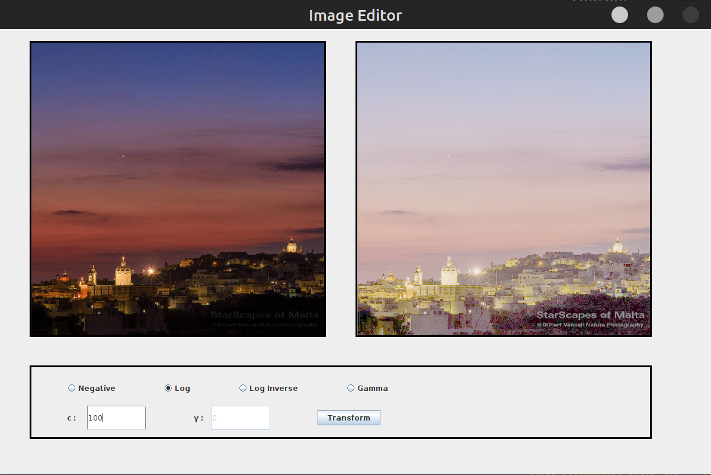
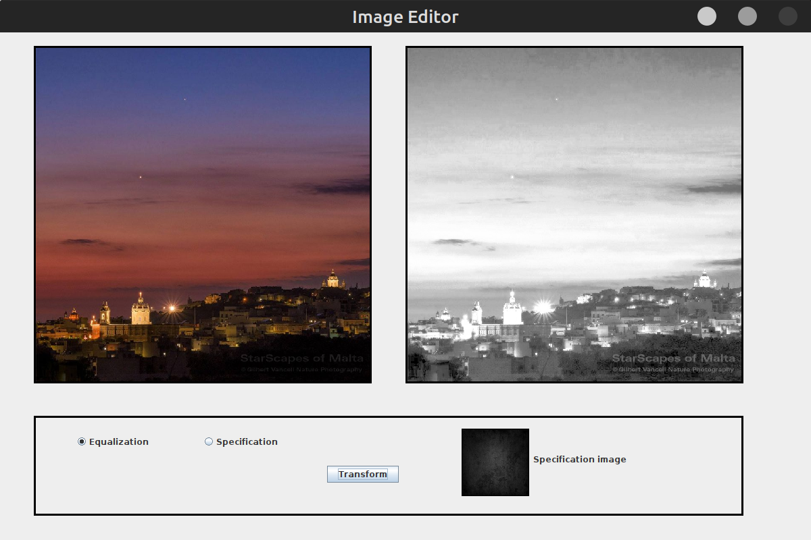
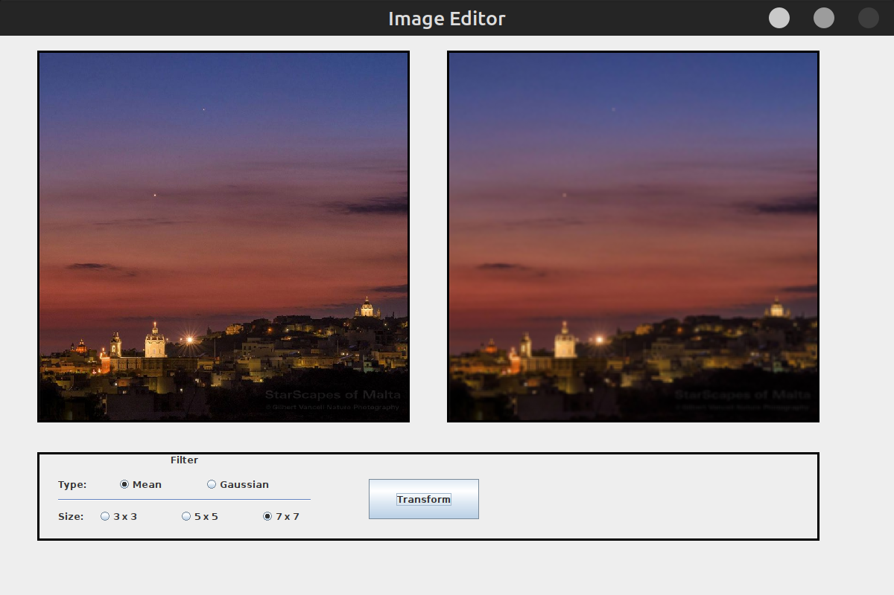
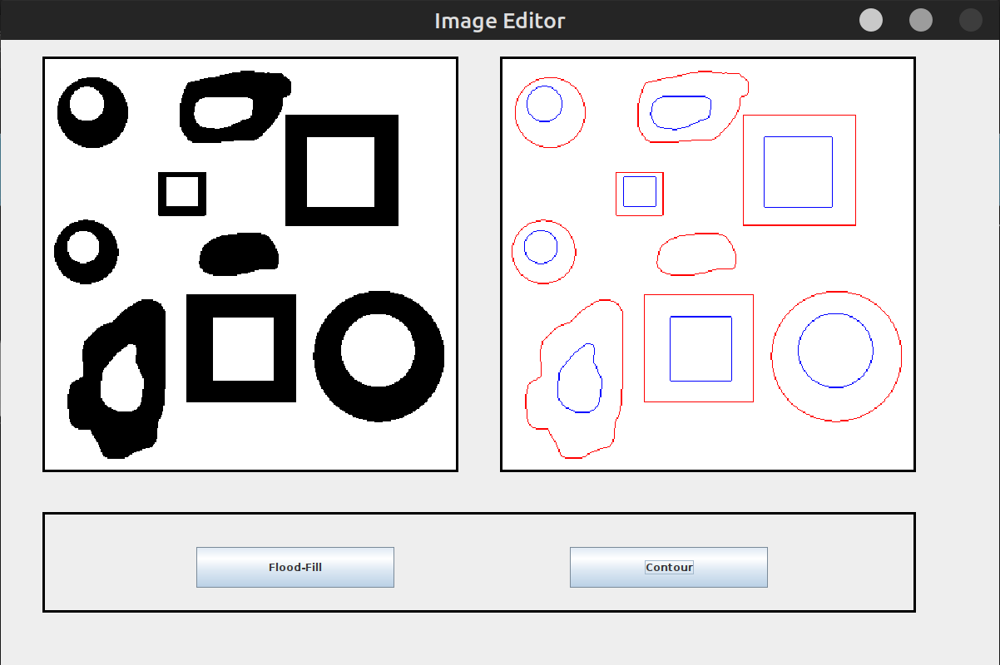

# image-editor
Created an image editor in Java. The editor can do negative, log, log inverse, and gamma transformations. Additionally, it can apply histogram specification,
equalization, and image smoothing with mean and Gaussian filters. Also, contour detection in binary images
is possible.

